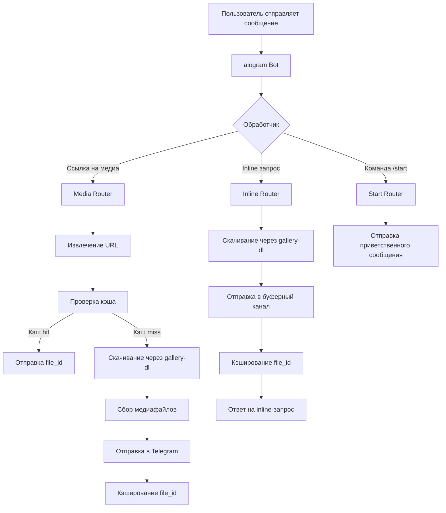

# Архитектура selfhost-tg-downloader

## Обзор

selfhost-tg-downloader — это самохостовый Telegram-бот для скачивания видео из TikTok и Instagram. Бот автоматически определяет ссылки в сообщениях, скачивает видео через `gallery-dl` и отправляет их обратно в чат.

## Стек технологий

- **Язык**: Python 3.14
- **Фреймворк**: aiogram 3.x (async Telegram Bot API)
- **Скачивание**: gallery-dl + ffmpeg
- **Кэширование**: SQLite (aiosqlite)
- **Логирование**: structlog
- **Управление зависимостями**: uv
- **Деплой**: systemd

## Компоненты

### 1. Входная точка (`src/__main__.py`)
- Инициализирует бота и диспетчер
- Загружает роутеры для обработки команд

### 2. Конфигурация (`src/config.py`)
- Загружает переменные окружения из `.env`
- Использует pydantic-settings для валидации

### 3. Обработчики (`src/handlers/`)
- `start.py` — обработка команды /start
- `media.py` — обработка текстовых сообщений со ссылками
- `inline.py` — обработка inline-запросов

### 4. Скачивание (`src/downloader/gallery.py`)
- Асинхронный wrapper вокруг gallery-dl
- Создание временной директории для каждого скачивания
- Сбор медиафайлов (видео/изображения)
- Автоматическая очистка после отправки

### 5. База данных (`src/database.py`)
- Кэширует file_id для повторных ссылок
- Использует SQLite с таблицей `media_cache`

## Диаграмма архитектуры



## Поток данных

1. **Сообщение пользователя** → Бот получает обновление
2. **Определение типа**:
   - Команда → Start Router
   - Ссылка → Media Router
   - Inline → Inline Router
3. **Обработка ссылки**:
   - Извлечение URL через регулярное выражение
   - Проверка кэша (если есть file_id → отправка без скачивания)
   - Если нет в кэше → скачивание через gallery-dl
4. **Отправка**:
   - Медиафайлы отправляются пользователю/в буферный канал
   - File_id кэшируются для повторного использования
5. **Очистка**: Временные файлы удаляются после отправки

## Конфигурация

### Переменные окружения (.env)
- `TELEGRAM_BOT_TOKEN` — токен от @BotFather
- `DOWNLOAD_DIR` — директория для временных файлов (по умолчанию `/tmp/tg-downloads`)
- `BUFFER_CHAT_ID` — ID буферного канала для inline-режима
- `COOKIES_FILE` — файл с куками Instagram
- `INSTAGRAM_USER`/`INSTAGRAM_PASS` — логин/пароль Instagram

### Systemd сервис
```ini
[Unit]
Description=Telegram Media Downloader Bot
After=network.target

[Service]
Type=simple
User=tg-bot
Group=tg-bot
WorkingDirectory=/opt/tg-downloader
ExecStart=/opt/tg-downloader/.venv/bin/python src
Restart=always
RestartSec=5
EnvironmentFile=/opt/tg-downloader/.env

[Install]
WantedBy=multi-user.target
```

## Безопасность

- Запуск от непривилегированного пользователя (рекомендуется)
- Автоматическая очистка временных файлов
- Кэширование file_id для уменьшения нагрузки
- Ограничение размера файлов (50 MB по умолчанию)

## Мониторинг

- Логирование через structlog
- JSON-логи с ротацией (docker-compose)
- Метрики доступны через journalctl

## Развертывание

### Через systemd (рекомендуется)
1. Создать пользователя `tg-bot`
2. Скопировать код в `/opt/tg-downloader`
3. Создать `.env` с настройками
4. Создать systemd сервис (см. выше)
5. Запустить: `systemctl start selfhost-tg-downloader`

### Через Docker
```bash
docker compose up -d --build
```

## Лицензия

MIT
